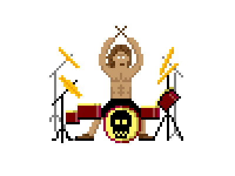

<!--
**Andreffelipe/Andreffelipe** is a ✨ _special_ ✨ repository because its `README.md` (this file) appears on your GitHub profile.

Here are some ideas to get you started:

- 🔭 I’m currently working on ...
- 🌱 I’m currently learning ...
- 👯 I’m looking to collaborate on ...
- 🤔 I’m looking for help with ...
- 💬 Ask me about ...
- 📫 How to reach me: ...
- 😄 Pronouns: ...
- ⚡ Fun fact: ...
-->

### Hello Guy, I'm Andre  

### Sobre mim

- 💻&nbsp; Trabalhando com NodeJS e Flutter
- 📚&nbsp; Estudando a Node e React
- 💜&nbsp; Sempre tentando ajudar outros da melhor forma possível
- 🧒&nbsp; Desenvolvedor em Keepin Automação Residencial

**Skills**

&nbsp;&nbsp;&nbsp;&nbsp;&nbsp;&nbsp;&nbsp;&nbsp;&nbsp;&nbsp;&nbsp;&nbsp;&nbsp;&nbsp;&nbsp;&nbsp;

**Utilidades**

**Ferramentas**

 
 

**Projetos**

 

